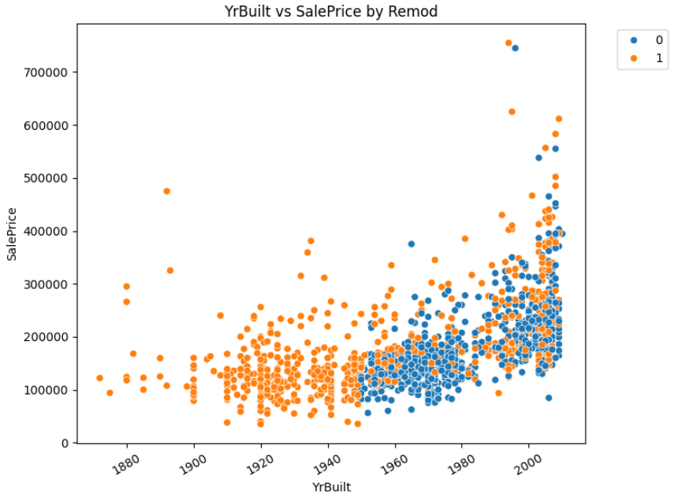

# House Pricing Prediction

This project uses the classic Kaggle Data set called House Prices to make predictions of, you guessed it, house prices.

## Correlation Matrix Numeric columns with Sale Price

Recommended: Download SVG file and analyze values with free zoom

---

## Scatter Plot (Sale Price by Year Built with Remodelling variable as Hue)

---
