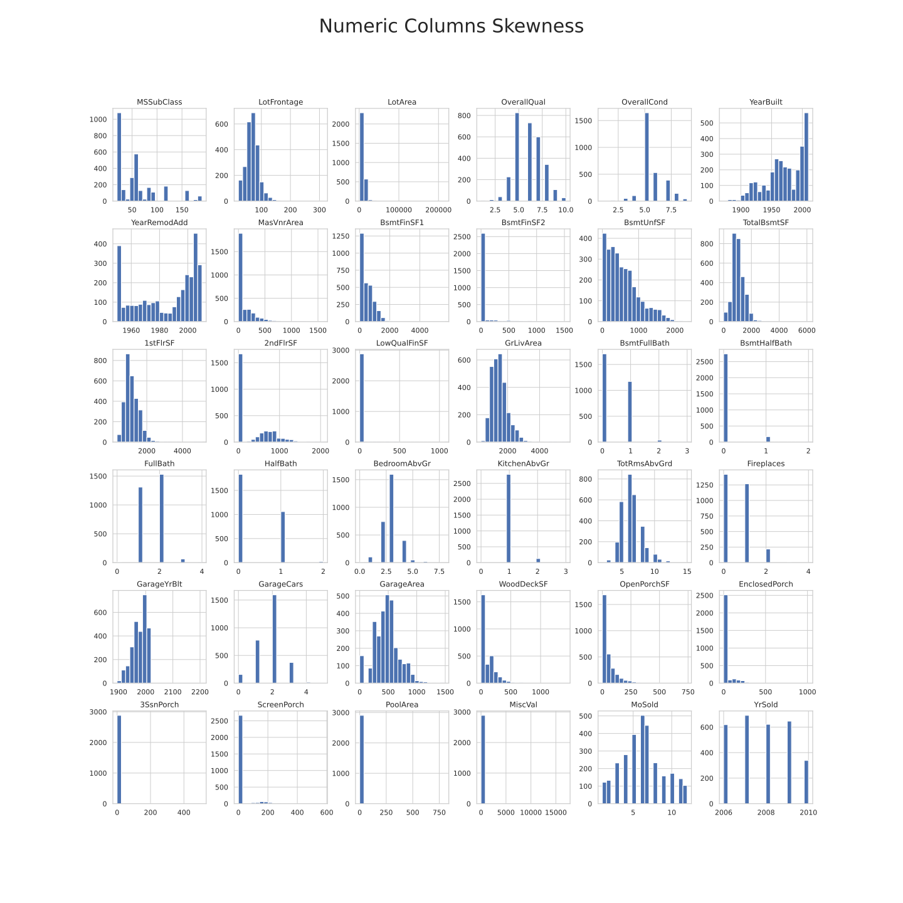
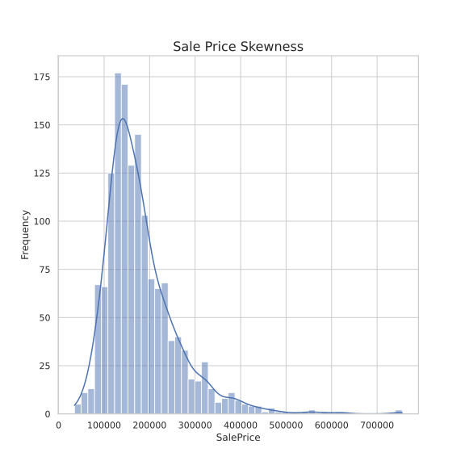

# House Pricing Prediction

This project uses the classic Kaggle Data set called House Prices to make predictions of, you guessed it, house prices.

---

## These are some plots from the EDA phase

## Histogram Plots that show skewness on numerical features

## Sale Prices skewness

---

## Correlation Matrix Numeric columns with Sale Price

**There are more plots in the imgs directory.**  
