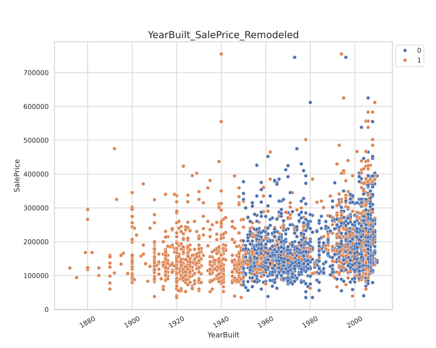

# House Pricing Prediction

This project uses the classic Kaggle Data set called House Prices to make predictions of, you guessed it, house prices.

---

## These are some plots from the EDA phase

## Histogram Plots that show skewness on numerical features

---

## Correlation Matrix Numeric columns with Sale Price

---

## Scatter Plot (Sale Price by Year Built with Remodelling variable as Hue)

---

## Line Plot (Sale Price by Age of House)

**There are more plots in the imgs directory.**  
